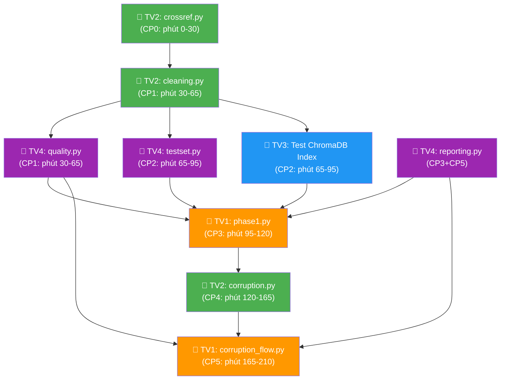

# 📋 PHÂN CÔNG CÔNG VIỆC NHÓM — Day 10 Data Pipeline & Observability

> **Tổng thời lượng:** 240 phút (4 giờ)  
> **Nguyên tắc:** Mỗi người sở hữu riêng các file cụ thể → **Không ai sửa chung 1 file** → Tránh conflict khi merge vào `main`.

---

## 🗺️ Tổng Quan Phân Vùng File

```text
src/
├── core/
│   ├── config.py          ← ĐÃ HOÀN THIỆN (không cần sửa)
│   └── utils.py           ← ĐÃ HOÀN THIỆN (không cần sửa)
├── ingestion/
│   ├── crossref.py        ← 👤 TV2 (Data Foundation Owner)
│   ├── cleaning.py        ← 👤 TV2 (Data Foundation Owner)
│   └── corruption.py      ← 👤 TV2 (Data Foundation Owner)
├── retrieval/
│   ├── embeddings.py      ← ĐÃ HOÀN THIỆN (không cần sửa)
│   ├── index.py           ← ĐÃ HOÀN THIỆN (không cần sửa)
│   ├── qa.py              ← ĐÃ HOÀN THIỆN (không cần sửa)
│   ├── llm.py             ← ĐÃ HOÀN THIỆN (không cần sửa)
│   └── agent.py           ← 👤 TV3 (RAG Specialist) — tuỳ chọn mở rộng
├── evaluation/
│   ├── testset.py         ← 👤 TV4 (Observability & Evaluation Lead)
│   └── metrics.py         ← ĐÃ HOÀN THIỆN (không cần sửa)
├── observability/
│   ├── quality.py         ← 👤 TV4 (Observability & Evaluation Lead)
│   └── reporting.py       ← 👤 TV4 (Observability & Evaluation Lead)
└── pipelines/
    ├── phase1.py          ← 👤 TV1 (Pipeline Lead)
    └── corruption_flow.py ← 👤 TV1 (Pipeline Lead)

report/
├── group_report.md        ← 👤 TV1 tổng hợp, cả nhóm review
└── individual_report.md   ← Mỗi người tự viết phần của mình

docs/
└── TEAM.md                ← 👤 TV1 điền thông tin nhóm
```

---

## 👤 TV1: Nguyễn Thanh Dương (2A202602961) — Pipeline Lead & Integrator (Trưởng nhóm)

### File sở hữu
| File | Hành động |
|:---|:---|
| `src/pipelines/phase1.py` | Implement hàm `main()` — điều phối toàn bộ Baseline Pipeline |
| `src/pipelines/corruption_flow.py` | Implement hàm `main()` — điều phối luồng Corruption → Repair → Compare |
| `docs/TEAM.md` | Điền thông tin nhóm, MSSV, phân công |
| `report/group_report.md` | Tổng hợp báo cáo nhóm |

### Nhiệm vụ theo Checkpoint

| Thời gian | Checkpoint | Nhiệm vụ |
|:---|:---|:---|
| 0 – 30m | **CP0** | Fork repo, setup `.env`, `venv`, smoke test. Điền `docs/TEAM.md` |
| 30 – 65m | **CP1** | ⏳ **Chờ TV2 + TV4 hoàn thành** → Review output của cleaning + quality |
| 65 – 95m | **CP2** | ⏳ **Chờ TV3 + TV4 hoàn thành** → Kiểm tra ChromaDB index + test set |
| 95 – 120m | **CP3** | ✅ **Implement `phase1.py`** — gọi lần lượt: load settings → fetch/load records → clean → save CSV/JSON → build index → build test set → evaluate → quality checks → freshness → generate report |
| 120 – 165m | **CP4** | ⏳ **Chờ TV2 xong `corruption.py`** → Bắt đầu implement `corruption_flow.py` |
| 165 – 210m | **CP5** | ✅ **Implement `corruption_flow.py`** — gọi: load baseline → corrupt → save → rebuild index → evaluate corrupted → repair từ raw → evaluate repaired → quality checks cả 2 → generate comparison report |
| 210 – 240m | **CP6** | Chạy demo `run_phase1.py` + `run_corruption_flow.py`, chuẩn bị trình bày, nộp bài |

### Chi tiết implement `phase1.py`
```python
# Pseudo-code cho main():
def main():
    settings = load_settings()
    # 1. Fetch hoặc load raw records
    if settings.refresh_source or not settings.paths.raw_records_json.exists():
        records = fetch_source_records(settings)
    else:
        records = load_raw_records(settings.paths.raw_records_json)
    # 2. Clean
    df = build_clean_dataframe(records, now_utc())
    # 3. Save
    write_csv(df, settings.paths.clean_csv)
    write_json(settings.paths.clean_json, df.to_dict(orient="records"))
    # 4. Build index
    index = LocalEmbeddingIndex.build(df, settings)
    # 5. Test set
    build_test_set(df, settings.paths.eval_testset)
    # 6. Evaluate
    bundle = evaluate_pipeline(settings, index, ...)
    # 7. Quality + Freshness
    quality = run_data_quality_checks(df, settings, "baseline")
    freshness = build_freshness_report(df, settings, ...)
    # 8. Report
    generate_phase1_report(...)
```

### Chi tiết implement `corruption_flow.py`
```python
def main():
    settings = load_settings()
    # 1. Load baseline clean data
    df_clean = pd.read_json(settings.paths.clean_json)
    # 2. Corrupt
    df_corrupted = corrupt_clean_dataframe(df_clean, settings.paths.corruption_log)
    # 3. Save corrupted
    write_csv(df_corrupted, settings.paths.corrupted_clean_csv)
    # 4. Build corrupted index + evaluate
    corrupted_index = LocalEmbeddingIndex.build(df_corrupted, settings, settings.paths.corrupted_embeddings_json)
    evaluate_pipeline(settings, corrupted_index, ..., corrupted paths)
    # 5. Quality checks on corrupted
    corrupted_quality = run_data_quality_checks(df_corrupted, settings, "corrupted")
    # 6. Repair from raw
    records = load_raw_records(settings.paths.raw_records_json)
    df_repaired = build_clean_dataframe(records, now_utc())
    # 7. Build repaired index + evaluate
    repaired_index = LocalEmbeddingIndex.build(df_repaired, settings, settings.paths.repaired_embeddings_json)
    evaluate_pipeline(settings, repaired_index, ..., repaired paths)
    # 8. Comparison report
    generate_corruption_report(...)
```

> ⚠️ **Phụ thuộc:**
> - `phase1.py` import từ `ingestion`, `retrieval`, `evaluation`, `observability` → TV1 chỉ bắt đầu khi TV2, TV3, TV4 xong các module tương ứng.
> - `corruption_flow.py` cần `corruption.py` của TV2 và `reporting.py` của TV4.

---

## 👤 TV2: Trần Nhật Minh (2A202602483) — Data Foundation Owner

### File sở hữu
| File | Hành động |
|:---|:---|
| `src/ingestion/crossref.py` | Implement 3 hàm: `parse_crossref_payload()`, `fetch_source_records()`, `load_raw_records()` |
| `src/ingestion/cleaning.py` | Implement `build_clean_dataframe()` |
| `src/ingestion/corruption.py` | Implement `corrupt_clean_dataframe()` — 6 dạng tiêm lỗi |

### Nhiệm vụ theo Checkpoint

| Thời gian | Checkpoint | Nhiệm vụ |
|:---|:---|:---|
| 0 – 30m | **CP0** | ✅ **Implement `crossref.py`** — parse payload + fetch + load raw records |
| 30 – 65m | **CP1** | ✅ **Implement `cleaning.py`** — normalize, tính `age_days`, tạo `text_for_embedding`, drop duplicates |
| 65 – 95m | **CP2** | 🔄 Hỗ trợ TV3 verify dữ liệu clean đúng format để nạp ChromaDB |
| 95 – 120m | **CP3** | 🔄 Hỗ trợ TV1 test `phase1.py` end-to-end, fix bug nếu có |
| 120 – 165m | **CP4** | ✅ **Implement `corruption.py`** — 6 kịch bản tiêm lỗi dữ liệu |
| 165 – 210m | **CP5** | 🔄 Verify luồng Repair: đảm bảo `load_raw_records()` → `build_clean_dataframe()` tạo lại dữ liệu sạch idempotent |
| 210 – 240m | **CP6** | Viết báo cáo cá nhân, hỗ trợ demo |

### Chi tiết implement

#### `crossref.py` — `parse_crossref_payload()`
```python
def parse_crossref_payload(payload: dict) -> list[PaperRecord]:
    records = []
    for item in payload["message"]["items"]:
        paper_id = item.get("DOI", "")
        title = " ".join(item.get("title", []))
        # strip HTML tags <jats:p>, etc.
        summary = re.sub(r"<[^>]+>", "", item.get("abstract", ""))
        authors = [f"{a.get('given','')} {a.get('family','')}".strip()
                   for a in item.get("author", [])]
        categories = item.get("subject", [])
        published = _extract_date(item, "published-print") or _extract_date(item, "published-online")
        updated = _extract_date(item, "deposited") or published
        abs_url = item.get("URL", "")
        pdf_url = next((l["URL"] for l in item.get("link", [])
                        if "pdf" in l.get("content-type", "")), "")
        comment = item.get("container-title", [""])[0] if item.get("container-title") else ""
        if paper_id and title and summary:
            records.append(PaperRecord(...))
    return records
```

#### `cleaning.py` — `build_clean_dataframe()`
Cột bắt buộc trong output DataFrame:
- `paper_id`, `title`, `summary`, `authors`, `categories`, `primary_category`
- `published`, `updated`, `abs_url`, `pdf_url`, `comment`
- `authors_joined` (str), `categories_joined` (str)
- `age_days` (int), `summary_chars` (int)
- **`text_for_embedding`** (str) — format:
  ```
  Title: {title}\nAuthors: {authors_joined}\nPublished: {published}\nCategories: {categories_joined}\nSummary: {summary}
  ```

#### `corruption.py` — 6 dạng lỗi
1. **Drop latest 20%** — sort by `published` desc, drop top 20%
2. **Blank summary** — set 3-5 dòng `summary = ""`
3. **Inject noise** — chèn `"@#$%NOISE@#$%"` vào giữa summary
4. **Truncate title** — cắt title còn 5-7 ký tự
5. **Stale date** — lùi `published` 365 ngày, recalc `age_days`
6. **Duplicate rows** — `pd.concat([df, df.sample(n=3)])`, rebuild `text_for_embedding`

> ⚠️ **Phụ thuộc:**
> - `crossref.py` và `cleaning.py` là **nền tảng** — TV3 và TV4 cần output của TV2 để bắt đầu việc.
> - ⏰ **Deadline cứng: phút 65** — Phải xong `crossref.py` + `cleaning.py` trước khi CP2 bắt đầu.
> - `corruption.py` **không phụ thuộc ai** — có thể implement song song từ CP2 trở đi.

---

## 👤 TV3: Ngô Minh Trí (2A202602993) — RAG & Agent Specialist

### File sở hữu
| File | Hành động |
|:---|:---|
| Không có file TODO riêng | Các file `retrieval/` đã hoàn thiện sẵn |
| `src/retrieval/agent.py` | (Tuỳ chọn) Mở rộng/test Agent demo |

### Nhiệm vụ theo Checkpoint

| Thời gian | Checkpoint | Nhiệm vụ |
|:---|:---|:---|
| 0 – 30m | **CP0** | Setup môi trường, đọc hiểu code `retrieval/index.py`, `qa.py`, `embeddings.py`, `agent.py` |
| 30 – 65m | **CP1** | ⏳ **Chờ TV2 xong `cleaning.py`** → Test thử tạo DataFrame sạch, hiểu format `text_for_embedding` |
| 65 – 95m | **CP2** | ✅ **Test build ChromaDB index** — Verify `LocalEmbeddingIndex.build(df, settings)` chạy đúng, collection `papers-baseline` có đủ 24 documents |
| 95 – 120m | **CP3** | 🔄 Hỗ trợ TV1 integrate & debug `phase1.py`, test `answer_question()` trên vài câu hỏi mẫu |
| 120 – 165m | **CP4** | 🔄 Test index trên dữ liệu corrupted — verify search quality giảm, hỗ trợ TV1 debug `corruption_flow.py` |
| 165 – 210m | **CP5** | 🔄 Test index trên dữ liệu repaired — verify phục hồi chất lượng, test `agent.py` demo |
| 210 – 240m | **CP6** | **Chuẩn bị demo Agent** — chạy vài câu hỏi live qua `build_agent()`, viết báo cáo cá nhân |

### Vai trò thực tế
TV3 đóng vai **QA/Tester chính** của nhóm vì các module `retrieval/` đã hoàn thiện. Công việc chính:
- **Verify** output của TV2 (clean data) phù hợp để nạp ChromaDB
- **Test** ChromaDB index: search, lookup hoạt động chính xác
- **Debug** cùng TV1 khi kết nối các module
- **Demo** Agent trước lớp

> 📝 TV3 **không sửa file nào của TV1, TV2, TV4**. Nếu phát hiện bug, báo cho người sở hữu file đó sửa. Chỉ sửa trong `retrieval/agent.py` nếu cần mở rộng.

---

## 👤 TV4: Dương Thị Hồng Viên (2A202602385) — Observability & Evaluation Lead

### File sở hữu
| File | Hành động |
|:---|:---|
| `src/observability/quality.py` | Implement `run_data_quality_checks()` + `build_freshness_report()` |
| `src/evaluation/testset.py` | Implement `build_test_set()` |
| `src/observability/reporting.py` | Implement `generate_phase1_report()` + `generate_corruption_report()` |

### Nhiệm vụ theo Checkpoint

| Thời gian | Checkpoint | Nhiệm vụ |
|:---|:---|:---|
| 0 – 30m | **CP0** | Setup môi trường, đọc hiểu GX 1.x API, chuẩn bị code skeleton cho `quality.py` |
| 30 – 65m | **CP1** | ✅ **Implement `quality.py`** — 4 Expectations + Freshness SLA |
| 65 – 95m | **CP2** | ✅ **Implement `testset.py`** — Sinh 10 câu hỏi (4 loại: summary, authors, date, categories) |
| 95 – 120m | **CP3** | ✅ **Implement `reporting.py` → `generate_phase1_report()`** |
| 120 – 165m | **CP4** | 🔄 Test quality checks trên corrupted data → verify `success=False` khi data bẩn |
| 165 – 210m | **CP5** | ✅ **Implement `reporting.py` → `generate_corruption_report()`** — Bảng 3 cột so sánh |
| 210 – 240m | **CP6** | Review báo cáo, giải thích GX 1.x + Freshness SLA cho phần Q&A |

### Chi tiết implement

#### `quality.py` — `run_data_quality_checks()`
```python
import great_expectations as gx
from great_expectations.expectations import (
    ExpectTableRowCountToBeBetween,
    ExpectColumnValuesToNotBeNull,
    ExpectColumnValuesToBeUnique,
    ExpectColumnValueLengthsToBeBetween,
)

def run_data_quality_checks(df, settings, report_name):
    context = gx.get_context(mode="ephemeral")
    data_source = context.data_sources.add_pandas(name="papers_source")
    data_asset = data_source.add_dataframe_asset(name="papers_asset")
    batch_def = data_asset.add_batch_definition_whole_dataframe("papers_batch")
    batch = batch_def.get_batch(batch_parameters={"dataframe": df})

    suite = context.add_expectation_suite(expectation_suite_name=f"{report_name}_suite")
    # 1. Row count 5-5000
    # 2. paper_id, title, text_for_embedding not null
    # 3. paper_id unique
    # 4. summary length >= 30

    # Validate & return {"success": True/False, "results": [...]}
```

#### `quality.py` — `build_freshness_report()`
```python
def build_freshness_report(df, settings, report_path):
    stale_count = (df["age_days"] > settings.freshness_threshold_days).sum()
    is_fresh = (stale_count / len(df)) <= 0.25  # <= 25% stale
    payload = {
        "latest_published": df["published"].max(),
        "oldest_published": df["published"].min(),
        "stale_rows": int(stale_count),
        "total_rows": len(df),
        "is_fresh": is_fresh,
    }
    write_json(report_path, payload)
    return payload
```

#### `testset.py` — `build_test_set()`
```python
def build_test_set(df, output_path):
    # Chọn >= 3 paper đại diện
    # Sinh 10 câu hỏi chia đều 4 loại:
    # - "What is the summary of the paper '<Title>'?"
    # - "Who authored the paper '<Title>'?"
    # - "When was the paper '<Title>' published?"
    # - "What categories does the paper '<Title>' belong to?"
    # Mỗi câu có ground_truth lấy từ df + ground_truth_doc_ids = [paper_id]
    write_json(output_path, test_set)
    return test_set
```

#### `reporting.py` — Reports
- `generate_phase1_report()`: Markdown với source info + metrics + quality + freshness
- `generate_corruption_report()`: Bảng markdown 3 cột: Baseline | Corrupted | Repaired

> ⚠️ **Phụ thuộc:**
> - `quality.py` cần DataFrame sạch từ TV2 để test → **Chờ TV2 xong `cleaning.py` (phút 65)**.
> - `testset.py` cần DataFrame sạch → cùng dependency.
> - `reporting.py` **không phụ thuộc ai khác** — chỉ cần biết format dict input, có thể code trước với mock data.

---

## 🔗 Sơ Đồ Phụ Thuộc Giữa Các Module



**Chú thích màu:** 🟠 TV1 (Pipeline Lead) · 🟢 TV2 (Data Foundation) · 🔵 TV3 (RAG Specialist) · 🟣 TV4 (Observability)

---

## 🚦 Quy Tắc Git — Tránh Conflict

### Nguyên tắc vàng
> **Mỗi người CHỈ sửa file trong vùng sở hữu của mình. KHÔNG sửa file của người khác.**

### Workflow đề xuất

```text
1. Mỗi người làm trên nhánh riêng:
   - TV1: git checkout -b feat/pipelines
   - TV2: git checkout -b feat/ingestion
   - TV3: git checkout -b feat/retrieval-test
   - TV4: git checkout -b feat/observability

2. Khi xong 1 checkpoint → commit + push nhánh riêng:
   git add <chỉ file của mình>
   git commit -m "CP1: implement cleaning.py - TV2"
   git push origin feat/ingestion

3. Merge vào main theo THỨ TỰ (TV1 là người merge):
   ① TV2 merge trước (vì các module khác phụ thuộc)
   ② TV4 merge tiếp
   ③ TV3 merge
   ④ TV1 merge cuối (vì pipeline import tất cả)

4. Trước khi merge: git pull origin main
```

### Cách merge không conflict
```bash
# TV1 (Pipeline Lead) thực hiện merge cho cả nhóm:
git checkout main
git pull origin main

# Merge TV2 trước
git merge feat/ingestion       # Chỉ sửa ingestion/ → Không conflict
git push origin main

# Merge TV4
git merge feat/observability   # Chỉ sửa observability/ + evaluation/ → Không conflict
git push origin main

# Merge TV3
git merge feat/retrieval-test  # Chỉ sửa retrieval/agent.py (nếu có) → Không conflict
git push origin main

# Merge TV1 cuối cùng
git merge feat/pipelines       # Chỉ sửa pipelines/ → Không conflict
git push origin main
```

> ⚠️ **File cấm sửa chung (nếu cần sửa → chỉ TV1 được sửa):**
> - `docs/TEAM.md`, `report/group_report.md`
> - Mỗi người tạo file báo cáo cá nhân riêng: `report/<MSSV>_<HoTen>.md`

---

## ⏱️ Timeline Tổng Hợp

```text
Phút     0         30        65        95       120       165       210      240
         |----------|---------|---------|---------|---------|---------|--------|
TV1      | Setup    | Chờ     | Chờ     |phase1.py|  Chờ    |corrupt_ | Demo   |
         | .env     | review  | review  |   ✅    | TV2    |flow.py  | Nộp bài|
         | TEAM.md  |         |         |         |        |   ✅    |        |
         |----------|---------|---------|---------|---------|---------|--------|
TV2      |crossref  |cleaning | Hỗ trợ  | Debug   |corrupt |  Verify | Report |
         |.py  ✅   |.py  ✅  | TV3     | với TV1 |.py ✅  |  Repair | cá nhân|
         |----------|---------|---------|---------|---------|---------|--------|
TV3      | Đọc code | Chờ TV2 | Test    | Debug   | Test   |  Test   | Demo   |
         | retrieval| → test  | ChromaDB| với TV1 |corrupt | repaired| Agent  |
         |          | clean   | index ✅|         | index  |  index  |        |
         |----------|---------|---------|---------|---------|---------|--------|
TV4      | Đọc GX   |quality  |testset  |report   | Test   |corrupt_ | Giải   |
         | 1.x docs |.py  ✅  |.py  ✅  |phase1 ✅| GX on  |report ✅| thích  |
         |          |         |         |         |corrupt |         | GX Q&A |
         |----------|---------|---------|---------|---------|---------|--------|
              CP0       CP1       CP2       CP3       CP4       CP5      CP6
```

**Ký hiệu:** ✅ = Implement chính | ⏳ = Chờ dependency | 🔄 = Hỗ trợ/Review

---

## ✅ Checklist Trước Khi Nộp

- [ ] `python script/run_phase1.py` chạy thành công
- [ ] `python script/run_corruption_flow.py` chạy thành công
- [ ] Tất cả 4 người đều có commit trên nhánh `main` (kiểm tra GitHub → Insights → Contributors)
- [ ] Mỗi người có file báo cáo cá nhân `report/<MSSV>_<HoTen>.md`
- [ ] File `.env` **KHÔNG** bị commit lên GitHub
- [ ] Mỗi thành viên tự nộp link repo lên VLearn LMS
